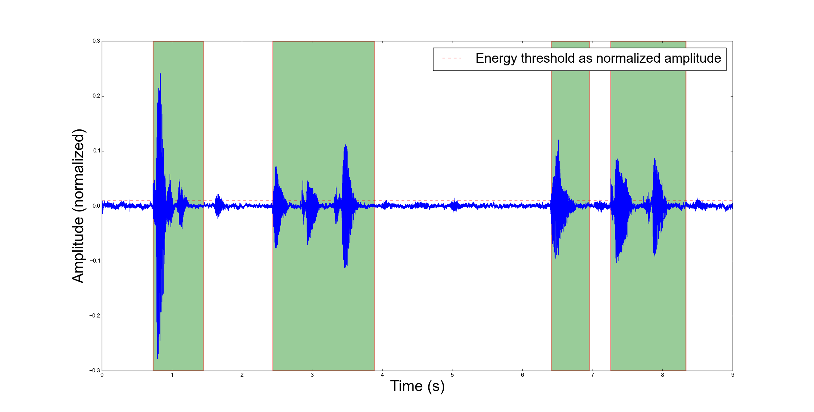
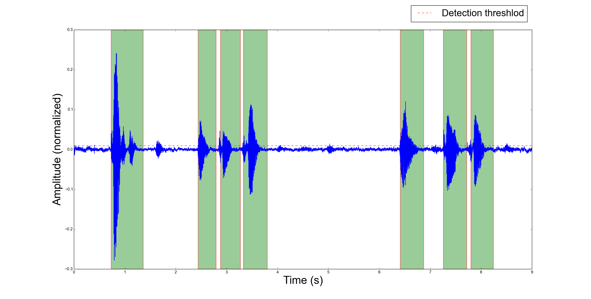

AUDIo TOKenizer 
===============

`auditok` is an **Audio Activity Detection** tool that can process online data (read from an audio device or from standard input) as well as audio files. It can be used as a command line program and offers an easy to use API.

- [Two-figure explanation](https://github.com/amsehili/auditok#two-figure-explanation)
- [Requirements](https://github.com/amsehili/auditok#requirements)
- [Installation](https://github.com/amsehili/auditok#installation)
- [Command line usage](https://github.com/amsehili/auditok#command-line-usage)
  - [Try the detector with your voice](https://github.com/amsehili/auditok#try-the-detector-with-your-voice)

Two-figure explanation
----------------------
The following two figures illustrate an audio signal (blue) and regions detected as valid audio activities (green rectangles) according to a given threshold (red dashed line). They respectively depict the detection result when:

1. the detector tolerates phases of silence of up to 0.3 second (300 ms) within an audio activity (also referred to as acoustic event):

2. the detector splits an audio activity event into many activities if the within activity silence is over 0.2 second:

Requirements
------------
`auditok` can be used with standard Python! 
However if you want more features, the following packages are needed:
- [pydub](https://github.com/jiaaro/pydub): read audio files of popular audio formats (ogg, mp3, etc.) or extract audio from a video file
- [PyAudio](http://people.csail.mit.edu/hubert/pyaudio/): read audio data from the microphone and play back detections
- `matplotlib`: plot audio signal and detections (see figures above)
- `numpy`: required by matplotlib. Also used for math operations instead of standard python if available
- Optionnaly, you can use `sox` or `parecord` for data acquisition and feed `auditok` using a pipe.

Installation
------------
    python setup.py install

Command line usage
------------------

### Try the detector with your voice

The first thing you want to check is perhaps how `auditok` detects your voice. If you have installed `PyAudio` just run (`Ctrl-C` to stop):

    auditok

This will print **id** **start time** and **end time** for each detected activity. If you don't have `PyAudio`, you can use `sox` for data acquisition (`sudo apt-get install sox`) and tell `auditok` to read data from standard input:

    rec -q -t raw -r 16000 -c 1 -b 16 -e signed - | auditok -i - -r 16000 -w 2 -c 1
    
Note that when data is read from standard input the same audio parameters must be used for both `sox` (or any other data generation/acquisition tool) and `auditok`. The following table summarizes audio parameters.

| Audio parameter | sox	option | auditok option | auditok default       |
| --------------- |------------|----------------|-----------------------|
| Sampling rate   |     -r     |       -r       |      16000            |
| Sample width    |  -b (bits) |     -w (bytes) |      2                |
| Channels        |  -c        |     -c         |      1                |
| Encoding        |  -e        |     None       | always signed integer |

According to this table, the previous command can be run as:

    rec -q -t raw -r 16000 -c 1 -b 16 -e signed - | auditok -i -

### Play back detections

    auditok -E

OR

    rec -q -t raw -r 16000 -c 1 -b 16 -e signed - | auditok -i - -E

Option `-E` stands for echo, so `auditok` plays back whatever it detects. Using `-E` requires `PyAudio`, if you don't have `PyAudio` and want to play detections with sox, use the `-C` option:

    rec -q -t raw -r 16000 -c 1 -b 16 -e signed - | auditok -i - -C "play -q -t raw -r 16000 -c 1 -b 16 -e signed $"
    
The `-C` option tells `auditok` to interpret its content as a command that should be run whenever `auditok` detects an audio activity, replacing the `$` by a name of a temporary file into which the activity is saved as raw audio. Here we use `play` to play the activity, giving the necessary `play` arguments for raw data.

`rec` and `play` are just an alias for `sox`.

The `-C` option can be useful in many cases. Imagine a command that sends audio data over a network only if there is an audio activity and saves bandwidth during silence.

### Set detection threshold

If you notice that there are too many detections, use a higher value for energy threshold (the current version only implements a `validator` based on energy threshold. The use of spectral information is also desirable and might be part of future releases). To change the energy threshold (default: 50), use option `-e`:

    auditok -E -e 55

OR

    rec -q -t raw -r 16000 -c 1 -b 16 -e signed - | auditok -i - -e 55 -C "play -q -t raw -r 16000 -c 1 -b 16 -e signed $"

If however you figure out that the detector is missing your some of or all audio activities, use a lower value for `e`.

### Set detection information format

By default, the `auditok` prints the `id` `start time` `end time` of each detected activity:

    1 1.87 2.67
    2 3.05 3.73
    3 3.97 4.49
    ...
    
If you want to personalize the output format, use `--printf` option:

    auditok -e 55 --printf "[{id}]: {start} to {end}"

Output:

    [1]: 0.22 to 0.67
    [2]: 2.81 to 4.18
    [3]: 5.53 to 6.44
    [4]: 7.32 to 7.82
    ...

Keywords `{id}`, `{start}` and `{end}` can be placed and repeate anywhere in the text. Time is shown in seconds, if you want a more detailed time information, use `--time-format`:

    auditok -e 55 --printf "[{id}]: {start} to {end}" --time-format "%h:%m:%s.%i"
    
Output:

    [1]: 00:00:01.080 to 00:00:01.760
    [2]: 00:00:02.420 to 00:00:03.440
    [3]: 00:00:04.930 to 00:00:05.570
    [4]: 00:00:05.690 to 00:00:06.020
    [5]: 00:00:07.470 to 00:00:07.980
    ...

Valid time directives are: `%h` (hours) `%m` (minutes) `%s` (seconds) `%i` (milliseconds). Two other directives, `%S` (default) and `%I` can be used for absolute time in seconds and milliseconds respectively.

## Practical use case: generate a subtitles template

Using `--printf ` and `--time-format`, the following command, used with an input file, will generate and **srt** file template that can be later edited a subtitles editor in a way that reduces the time needed to define when each utterance starts and where it ends: 

    auditok -e 55 -i input.wav -m 10 --printf "{id}\n{start} --> {end}\nPut some text here...\n" --time-format "%h:%m:%s.%i"

Output:

    1
    00:00:00.730 --> 00:00:01.460
    Put some text here...
    
    2
    00:00:02.440 --> 00:00:03.900
    Put some text here...

    3
    00:00:06.410 --> 00:00:06.970
    Put some text here...

    4
    00:00:07.260 --> 00:00:08.340
    Put some text here...

    5
    00:00:09.510 --> 00:00:09.820
    Put some text here...

### Plot signal and detections:

use option `-p`. Requires `matplotlib` and `numpy`.

    auditok ...  -p

### Save plot as image

    auditok ...  --save-image output.png

Requires `matplotlib` and `numpy`. Accepted formats: eps, jpeg, jpg, pdf, pgf, png, ps, raw, rgba, svg, svgz, tif, tiff.

### Read data from file

    auditok -i input.wav ...

Install `pydub` for other audio formats.

### Limit the length of aquired data

    auditok -M 12 ...

Time is in seconds.

### Save the whole acquired audio signal

    auditok -O output.wav ...

Install `pydub` for other audio formats.

### Save each detection into a separate audio file

    auditok -o det_{N}_{start}_{end}.wav ...

You can use a free text and place `{N}`, `{start}` and `{end}` wherever you want, they will be replaced by detection number, start time and end time respectively. Another example:

    auditok -o {start}-{end}.wav ...
    
Install `pydub` for more audio formats.

License
-------
`auditok` is published under the GNU General Public License Version 3.

Author
------
Amine Sehili (<amine.sehili@gmail.com>)

