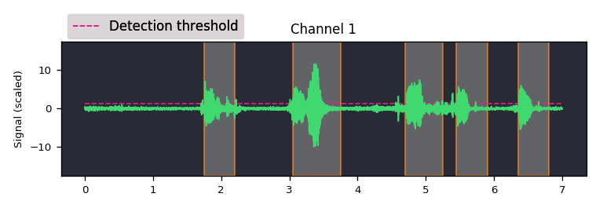

.. image:: https://travis-ci.org/amsehili/auditok.svg?branch=master
    :target: https://travis-ci.org/amsehili/auditok

.. image:: https://readthedocs.org/projects/auditok/badge/?version=latest
    :target: http://auditok.readthedocs.org/en/latest/?badge=latest
    :alt: Documentation Status

``auditok`` is an **Audio Activity Detection** tool that can process online data (read from an audio device or from standard input) as well as audio files. It can be used as a command line program or by calling its API.

A basic version of ``auditok`` will run with standard Python (>=3.4). Without installing additional dependencies, ``auditok`` can only deal with audio files in *wav* or *raw* formats. if you want more features, the following packages are needed:

- `pydub <https://github.com/jiaaro/pydub>`_ : read audio files in popular audio formats (ogg, mp3, etc.) or extract audio from a video file.

- `pyaudio <http://people.csail.mit.edu/hubert/pyaudio/>`_ : read audio data from the microphone and play back detections.

- `tqdm <https://github.com/tqdm/tqdm>`_ : show progress bar while playing audio clips.

- `matplotlib <http://matplotlib.org/>`_ : plot audio signal and detections (see figures above ).

- `numpy <http://www.numpy.org>`_ : required by matplotlib. Also used for some math operations instead of standard python if available.

Installation
------------

.. code:: bash

    git clone https://github.com/amsehili/auditok.git
    cd auditok
    python setup.py install

Basic example
-------------

.. code:: python

    from auditok import split

    # split returns a generator of AudioRegion objects
    audio_regions = split("audio.wav")
    for region in audio_regions:
        region.play(progress_bar=True)
        filename = region.save("/tmp/region_{meta.start:.3f}.wav")
        print("region saved as: {}".format(filename))

Example using `AudioRegion`
---------------------------

.. code:: python

    from auditok import AudioRegion
    region = AudioRegion.load("audio.wav")
    regions = region.split_and_plot() # or just region.splitp()

output figure:

Working with AudioRegions
-------------------------

Beyond splitting, there are a couple of interesting operations you can do with ``AudioRegion`` objects.

Concatenate regions
===================

.. code:: python

    from auditok import AudioRegion
    region_1 = AudioRegion.load("audio_1.wav")
    region_2 = AudioRegion.load("audio_2.wav")
    region_3 = region_1 + region_2

Particularly useful if you want to join regions returned by ``split``:

.. code:: python

    from auditok import AudioRegion
    regions = AudioRegion.load("audio.wav").split()
    gapless_region = sum(regions)

Repeat a region
===============

Multiply by a positive integer:

.. code:: python

    from auditok import AudioRegion
    region = AudioRegion.load("audio.wav")
    region_x3 = region * 3

Make slices of equal size out of a region
=========================================

Divide by a positive integer:

.. code:: python

    from auditok import AudioRegion
    region = AudioRegion.load("audio.wav")
    regions = regions / 5
    assert sum(regions) == region

Make audio slices of arbitrary size
===================================

Slicing an ``AudioRegion`` can be interesting in many situations. You can for example remove a fixed-size portion of audio data from the beginning or the end of a region or crop a region by an arbitrary amount as a data augmentation strategy, etc.

The most accurate way to slice an ``AudioRegion`` is to use indices that directly refer to raw audio samples. In the following example, assuming that the sampling rate of audio data is 16000, you can extract a 5-second region from main region, starting from the 20th second as follows:

.. code:: python

    from auditok import AudioRegion
    region = AudioRegion.load("audio.wav")
    start = 20 * 16000
    stop = 25 * 16000
    five_second_region = region[start:stop]

This allows you to practically start and stop at any sample within the region. Just as with a `list` you can omit one of `start` and `stop`, or both. You can also use negative indices:

.. code:: python

    from auditok import AudioRegion
    region = AudioRegion.load("audio.wav")
    start = -3 * region.sr # `sr` is an alias of `sampling_rate`
    three_last_seconds = region[start:]

While slicing by raw samples is accurate, slicing with temporal indices is more intuitive. You can do so by accessing the ``millis`` or ``seconds`` views of ``AudioRegion`` (or their shortcut alias ``ms`` and ``sec``/``s``).

With the ``millis`` view:

.. code:: python

    from auditok import AudioRegion
    region = AudioRegion.load("audio.wav")
    five_second_region = region.millis[5000:10000]

or with the ``seconds`` view

.. code:: python

    from auditok import AudioRegion
    region = AudioRegion.load("audio.wav")
    five_second_region = region.seconds[5:10]

Get an array of audio samples
=============================

.. code:: python

    from auditok import AudioRegion
    region = AudioRegion.load("audio.wav")
    samples = region.samples

If ``numpy`` is installed, this will return a ``numpy.ndarray``. If audio data is mono the returned array is 1D, otherwise it's 2D. If ``numpy`` is not installed this will return a standard ``array.array`` for mono data, and a list of ``array.array`` for multichannel data.

Alternatively you can use:

.. code:: python

    import numpy as np
    region = AudioRegion.load("audio.wav")
    samples = np.asarray(region)

License
-------
MIT.

