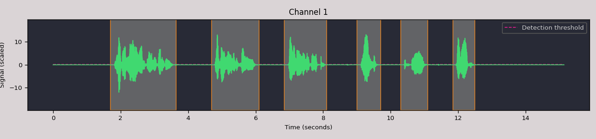
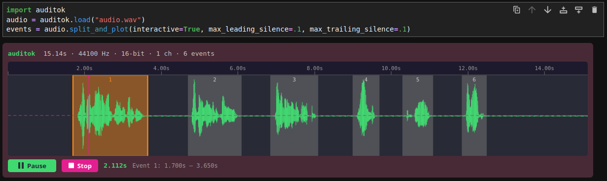

.. image:: https://img.shields.io/pypi/v/auditok.svg
    :target: https://pypi.org/project/auditok/
    :alt: PyPI version

.. image:: https://img.shields.io/pypi/pyversions/auditok.svg
    :target: https://pypi.org/project/auditok/
    :alt: Python versions

.. image:: https://github.com/amsehili/auditok/actions/workflows/ci.yml/badge.svg
    :target: https://github.com/amsehili/auditok/actions/workflows/ci.yml/
    :alt: Build Status

.. image:: https://codecov.io/github/amsehili/auditok/graph/badge.svg?token=0rwAqYBdkf
    :target: https://codecov.io/github/amsehili/auditok

.. image:: https://readthedocs.org/projects/auditok/badge/?version=latest
    :target: http://auditok.readthedocs.org/en/latest/?badge=latest
    :alt: Documentation Status

**auditok** is a lightweight, dependency-free audio activity detection library
for Python. It splits audio streams into events by thresholding signal energy
(no models or training data required).

Use it for voice activity detection, silence removal, audio segmentation,
or any task where you need to find "where the sound is" in an audio stream.
It works with files, microphone input, and streams, supports mono and
multi-channel audio, and runs from a few lines of Python or the command line.

Full documentation is available on `Read the Docs <https://auditok.readthedocs.io/en/latest/>`_.

Installation
------------

``auditok`` requires Python 3.8 or higher. The core library depends only on
``numpy``.

.. code:: bash

    pip install auditok

For plotting, audio playback, and progress bars:

.. code:: bash

    pip install auditok[all]

**Note:** Processing non-WAV formats (MP3, OGG, FLAC, video files, etc.)
requires `ffmpeg <https://ffmpeg.org/>`_ to be installed on your system.

API at a glance
---------------

+---------------------+-------------------------------------------------+-------------------------------------------------+
| Function            | Purpose                                         | Key parameters                                  |
+=====================+=================================================+=================================================+
| ``split()``         | Detect and yield audio events as a generator    | ``min_dur``, ``max_dur``, ``max_silence``,      |
|                     |                                                 | ``energy_threshold``                            |
+---------------------+-------------------------------------------------+-------------------------------------------------+
| ``trim()``          | Remove leading and trailing silence             | ``min_dur``, ``max_silence``,                   |
|                     |                                                 | ``energy_threshold``                            |
+---------------------+-------------------------------------------------+-------------------------------------------------+
| ``fix_pauses()``    | Normalize pauses between events to a fixed      | ``silence_duration``, ``min_dur``,              |
|                     | duration                                        | ``max_silence``, ``energy_threshold``           |
+---------------------+-------------------------------------------------+-------------------------------------------------+
| ``split_and_plot()``| Split and visualize results (matplotlib or      | split params + ``interactive``,                 |
|                     | interactive Jupyter widget)                     | ``save_as``                                     |
+---------------------+-------------------------------------------------+-------------------------------------------------+
| ``load()``          | Load audio from file, bytes, or mic into an     | ``sr``, ``sw``, ``ch``                          |
|                     | ``AudioRegion``                                 |                                                 |
+---------------------+-------------------------------------------------+-------------------------------------------------+

All functions accept file paths, raw bytes, ``AudioRegion`` objects, or ``None``
(to read from the microphone). ``split()``, ``trim()``, ``fix_pauses()``, and
``split_and_plot()`` are also available as ``AudioRegion`` methods.

Basic usage
-----------

.. code:: python

    import auditok

    # split returns a generator of AudioRegion objects
    audio_events = auditok.split(
        "audio.wav",
        min_dur=0.2,     # minimum duration of a valid audio event in seconds
        max_dur=4,       # maximum duration of an event
        max_silence=0.3, # maximum tolerated silence within an event
        energy_threshold=55 # detection threshold
    )

    for i, r in enumerate(audio_events):
        # AudioRegions returned by split have start and end attributes
        print(f"Event {i}: {r.start:.3f}s -- {r.end:.3f}s")

        # play the audio event
        r.play(progress_bar=True)

        # save the event with start and end times in the filename
        filename = r.save("event_{start:.3f}-{end:.3f}.wav")
        print(f"Event saved as: {filename}")

Example output:

.. code:: bash

    Event 0: 0.700s -- 1.400s
    Event saved as: event_0.700-1.400.wav
    Event 1: 3.800s -- 4.500s
    Event saved as: event_3.800-4.500.wav
    ...

Trim silence
~~~~~~~~~~~~

.. code:: python

    import auditok

    # Remove leading and trailing silence
    trimmed = auditok.trim("audio.wav", energy_threshold=55)
    trimmed.save("trimmed.wav")

Normalize pauses
~~~~~~~~~~~~~~~~

.. code:: python

    import auditok

    # Replace all pauses with exactly 0.5s of silence
    cleaned = auditok.fix_pauses("audio.wav", silence_duration=0.5)
    cleaned.save("cleaned.wav")

Improving detection boundaries
~~~~~~~~~~~~~~~~~~~~~~~~~~~~~~

Energy-based detection can clip the natural onset and fade-out of speech, where
the signal rises gradually from or falls back into silence. The
``max_leading_silence`` and ``max_trailing_silence`` parameters let you extend
detection boundaries to capture these transitions:

.. code:: python

    events = auditok.split(
        "audio.wav",
        max_leading_silence=0.2,   # prepend up to 200ms before each event
        max_trailing_silence=0.15, # keep up to 150ms of silence after each event
    )

Values of 0.1 -- 0.3 seconds typically work well. These parameters are available
on ``split()``, ``trim()``, ``fix_pauses()``, and their ``AudioRegion`` method
counterparts, as well as on the command line (``-l`` / ``--max-leading-silence``
and ``-g`` / ``--max-trailing-silence``).

Split and plot
--------------

Visualize the audio signal with detected events:

.. code:: python

    import auditok

    import auditok
    audio = auditok.load("audio.wav")
    events = audio.split_and_plot(max_leading_silence=0.1,
                                  max_trailing_silence=0.1) # or region.splitp(...)

Interactive widget in Jupyter
~~~~~~~~~~~~~~~~~~~~~~~~~~~~~

Pass ``interactive=True`` to ``split_and_plot`` to get an HTML5/Canvas/WebAudio
widget with clickable detection regions and inline playback:

.. code:: python

    events = audio.split_and_plot(interactive=True,
                                  max_leading_silence=0.1,
                                  max_trailing_silence=0.1)

Working with ``AudioRegion``
----------------------------

``AudioRegion`` is the central data structure. It wraps raw audio bytes with
metadata (sampling rate, sample width, channels) and provides a rich API
for slicing, combining, and exporting audio.

.. code:: python

    import auditok

    region = auditok.load("audio.wav")

    # Time-based slicing (returns a new AudioRegion)
    first_five_seconds = region.sec[0:5]
    middle = region.ms[1500:3000]  # milliseconds

    # Concatenation
    combined = region1 + region2

    # Repetition
    repeated = region * 3

    # Playback
    region.play(progress_bar=True)

    # Save with template placeholders
    region.save("output_{start:.3f}-{end:.3f}.wav")

    # Export as numpy array: shape (channels, samples)
    x = region.numpy()
    assert x.shape[0] == region.channels
    assert x.shape[1] == len(region)

In Jupyter notebooks, ``AudioRegion`` objects render as inline HTML5 audio
players automatically.

Command line
------------

``auditok`` provides three subcommands: ``split`` (default), ``trim``, and
``fix-pauses``. All three support file input and microphone recording.

Split audio into events
~~~~~~~~~~~~~~~~~~~~~~~

.. code:: bash

    # Split a file (default subcommand, both forms are equivalent)
    auditok split audio.wav -e 55 -n 0.5 -m 10 -s 0.3
    # Or simply
    auditok audio.wav -e 55 -n 0.5 -m 10 -s 0.3

    # Save detected events to individual files
    auditok audio.wav -o "event_{id}_{start:.3f}-{end:.3f}.wav"

    # Stream from microphone
    auditok

Trim silence
~~~~~~~~~~~~

.. code:: bash

    # Remove leading and trailing silence
    auditok trim audio.wav -o trimmed.wav

    # Record from microphone, trim, and save
    auditok trim -o trimmed.wav

Normalize pauses
~~~~~~~~~~~~~~~~

.. code:: bash

    # Replace all pauses with 0.5s of silence
    auditok fix-pauses audio.wav -o cleaned.wav -d 0.5

    # Record from microphone, normalize pauses, and save
    auditok fix-pauses -o cleaned.wav -d 0.5

Common options
~~~~~~~~~~~~~~

.. code:: text

    -e, --energy-threshold   Detection threshold [default: 50]
    -n, --min-duration       Minimum event duration in seconds [default: 0.2]
    -m, --max-duration       Maximum event duration in seconds (split only) [default: 5]
    -s, --max-silence        Max silence within an event [default: 0.3]
    -l, --max-leading-silence  Silence to retain before events [default: 0]
    -g, --max-trailing-silence Trailing silence to keep [default: all]

Limitations
-----------

``auditok`` uses energy-based detection. It works well in low-noise environments
-- podcasts, language lessons, recordings in quiet rooms -- where the signal is
clearly above the background noise.

It does not distinguish speech from other sounds (music, claps, environmental
noise), and the energy threshold is static. Manual tuning per recording may be
needed for best results.

License
-------

MIT.
