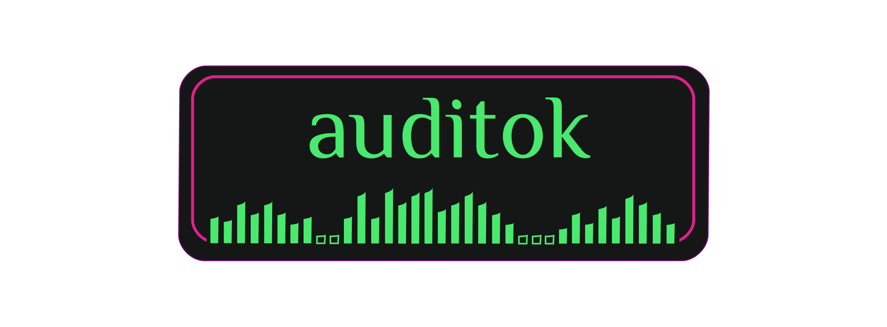

.. image:: https://travis-ci.org/amsehili/auditok.svg?branch=master
    :target: https://travis-ci.org/amsehili/auditok

.. image:: https://readthedocs.org/projects/auditok/badge/?version=latest
    :target: http://auditok.readthedocs.org/en/latest/?badge=latest
    :alt: Documentation status

``auditok`` is an **Audio Activity Detection** tool that can process online data
(read from an audio device or from standard input) as well as audio files.
It can be used as a command-line program or by calling its API.

The latest version of the documentation can be found on
`readthedocs. <https://auditok.readthedocs.io/en/latest/>`_

Installation
------------

A basic version of ``auditok`` will run with standard Python (>=3.4). However,
without installing additional dependencies, ``auditok`` can only deal with audio
files in *wav* or *raw* formats. if you want more features, the following
packages are needed:

- `pydub <https://github.com/jiaaro/pydub>`_ : read audio files in popular audio formats (ogg, mp3, etc.) or extract audio from a video file.
- `pyaudio <https://people.csail.mit.edu/hubert/pyaudio>`_ : read audio data from the microphone and play audio back.
- `tqdm <https://github.com/tqdm/tqdm>`_ : show progress bar while playing audio clips.
- `matplotlib <https://matplotlib.org/stable/index.html>`_ : plot audio signal and detections.
- `numpy <https://numpy.org/>`_ : required by matplotlib. Also used for some math operations instead of standard python if available.

Install the latest stable version with pip:

.. code:: bash

    sudo pip install auditok

Install the latest development version from github:

.. code:: bash

    pip install git+https://github.com/amsehili/auditok

or

.. code:: bash

    git clone https://github.com/amsehili/auditok.git
    cd auditok
    python setup.py install

Basic example
-------------

.. code:: python

    import auditok

    # split returns a generator of AudioRegion objects
    audio_regions = auditok.split(
        "audio.wav",
        min_dur=0.2,     # minimum duration of a valid audio event in seconds
        max_dur=4,       # maximum duration of an event
        max_silence=0.3, # maximum duration of tolerated continuous silence within an event
        energy_threshold=55 # threshold of detection
    )

    for i, r in enumerate(audio_regions):

        # Regions returned by `split` have 'start' and 'end' metadata fields
        print("Region {i}: {r.meta.start:.3f}s -- {r.meta.end:.3f}s".format(i=i, r=r))

        # play detection
        # r.play(progress_bar=True)

        # region's metadata can also be used with the `save` method
        # (no need to explicitly specify region's object and `format` arguments)
        filename = r.save("region_{meta.start:.3f}-{meta.end:.3f}.wav")
        print("region saved as: {}".format(filename))

output example:

.. code:: bash

    Region 0: 0.700s -- 1.400s
    region saved as: region_0.700-1.400.wav
    Region 1: 3.800s -- 4.500s
    region saved as: region_3.800-4.500.wav
    Region 2: 8.750s -- 9.950s
    region saved as: region_8.750-9.950.wav
    Region 3: 11.700s -- 12.400s
    region saved as: region_11.700-12.400.wav
    Region 4: 15.050s -- 15.850s
    region saved as: region_15.050-15.850.wav

Split and plot
--------------

Visualize audio signal and detections:

.. code:: python

    import auditok
    region = auditok.load("audio.wav") # returns an AudioRegion object
    regions = region.split_and_plot(...) # or just region.splitp()

output figure:

.. image:: doc/figures/example_1.png

Limitations
-----------

Currently, the core detection algorithm is based on the energy of audio signal.
While this is fast and works very well for audio streams with low background
noise (e.g., podcasts with few people talking, language lessons, audio recorded
in a rather quiet environment, etc.) the performance can drop as the level of
noise increases. Furthermore, the algorithm makes no distinction between speech
and other kinds of sounds, so you shouldn't use it for Voice Activity Detection
if your audio data also contain non-speech events.

License
-------
MIT.
