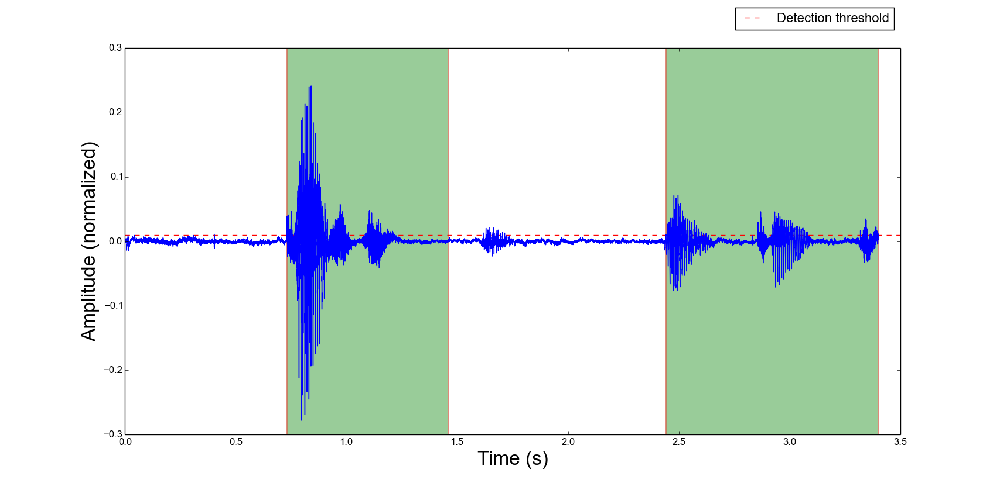
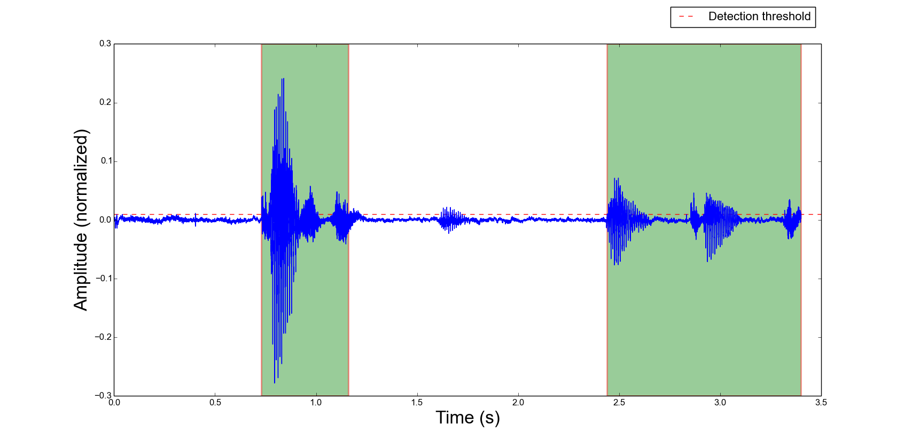
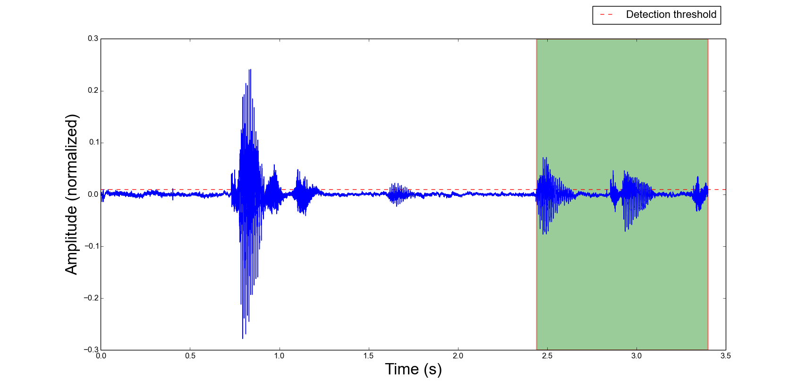
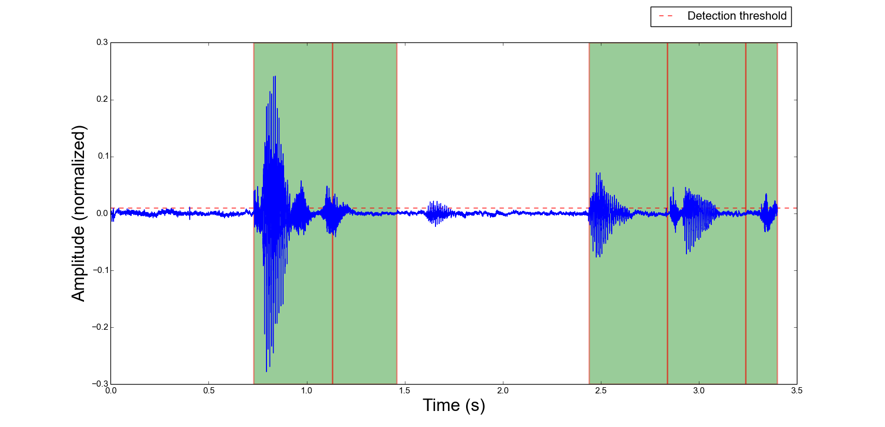

`auditok` Command-line Usage Guide
==================================

This user guide will go through a few of the most useful operations you can use **auditok** for and present two practical use cases.

.. contents:: `Contents`
   :depth: 3

**********************
Two-figure explanation
**********************

The following two figures illustrate an audio signal (blue) and regions detected as valid audio activities (green rectangles) according to
a given threshold (red dashed line). They respectively depict the detection result when:

1. the detector tolerates phases of silence of up to 0.3 second (300 ms) within an audio activity (also referred to as acoustic event):

.. figure:: figures/figure_1.png
    :align: center
    :alt: Output from a detector that tolerates silence periods up to 300 ms
    :figclass: align-center
    :scale: 40 %

2. the detector splits an audio activity event into many activities if the within activity silence is over 0.2 second:

.. figure:: figures/figure_2.png
    :align: center
    :alt: Output from a detector that tolerates silence periods up to 200 ms
    :figclass: align-center
    :scale: 40 %

Beyond plotting signal and detections, you can play back audio activities as they are detected, save them or run a user command each time there is an activity,
using, optionally, the file name of audio activity as an argument for the command.

******************
Command line usage
******************

Try the detector with your voice
################################

The first thing you want to check is perhaps how **auditok** detects your voice. If you have installed `PyAudio` just run (`Ctrl-C` to stop):

.. code:: bash

    auditok

This will print **id** **start-time** and **end-time** for each detected activity. If you don't have `PyAudio`, you can use `sox` for data acquisition (`sudo apt-get install sox`) and tell **auditok** to read data from standard input:

    rec -q -t raw -r 16000 -c 1 -b 16 -e signed - | auditok -i - -r 16000 -w 2 -c 1

Note that when data is read from standard input the same audio parameters must be used for both `sox` (or any other data generation/acquisition tool) and **auditok**. The following table summarizes audio parameters.

+-----------------+------------+------------------+-----------------------+
| Audio parameter | sox option | `auditok` option | `auditok` default     |
+=================+============+==================+=======================+
| Sampling rate   |     -r     |       -r         |      16000            |
+-----------------+------------+------------------+-----------------------+
| Sample width    |  -b (bits) |     -w (bytes)   |      2                |
+-----------------+------------+------------------+-----------------------+
| Channels        |  -c        |     -c           |      1                |
+-----------------+------------+------------------+-----------------------+
| Encoding        |  -e        |     None         | always signed integer |
+-----------------+------------+------------------+-----------------------+

According to this table, the previous command can be run as:

.. code:: bash

    rec -q -t raw -r 16000 -c 1 -b 16 -e signed - | auditok -i -

Play back detections
####################

.. code:: bash

    auditok -E

:or:

.. code:: bash

    rec -q -t raw -r 16000 -c 1 -b 16 -e signed - | auditok -i - -E

Option `-E` stands for echo, so **auditok** will play back whatever it detects. Using `-E` requires `PyAudio`, if you don't have `PyAudio` and want to play detections with sox, use the `-C` option:

.. code:: bash

    rec -q -t raw -r 16000 -c 1 -b 16 -e signed - | auditok -i - -C "play -q -t raw -r 16000 -c 1 -b 16 -e signed $"

The `-C` option tells **auditok** to interpret its content as a command that should be run whenever **auditok** detects an audio activity, replacing the `$` by a name of a temporary file into which the activity is saved as raw audio. Here we use `play` to play the activity, giving the necessary `play` arguments for raw data.

`rec` and `play` are just an alias for `sox`.

The `-C` option can be useful in many cases. Imagine a command that sends audio data over a network only if there is an audio activity and saves bandwidth during silence.

Set detection threshold
#######################

If you notice that there are too many detections, use a higher value for energy threshold (the current version only implements a `validator` based on energy threshold. The use of spectral information is also desirable and might be part of future releases). To change the energy threshold (default: 50), use option `-e`:

.. code:: bash

    auditok -E -e 55

:or:

.. code:: bash

    rec -q -t raw -r 16000 -c 1 -b 16 -e signed - | auditok -i - -e 55 -C "play -q -t raw -r 16000 -c 1 -b 16 -e signed $"

If however you figure out that the detector is missing some of or all your audio activities, use a lower value for `-e`.

Set format for printed detections information
#############################################

By default, **auditok** prints the **id**, **start-time** and **end-time** of each detected activity:

.. code:: bash

    1 1.87 2.67
    2 3.05 3.73
    3 3.97 4.49
    ...

If you want to customize the output format, use `--printf` option:

.. code:: bash

    auditok -e 55 --printf "[{id}]: {start} to {end}"

:output:

.. code:: bash

    [1]: 0.22 to 0.67
    [2]: 2.81 to 4.18
    [3]: 5.53 to 6.44
    [4]: 7.32 to 7.82
    ...

Keywords `{id}`, `{start}` and `{end}` can be placed and repeated anywhere in the text. Time is shown in seconds, if you want a more detailed time information, use `--time-format`:

    auditok -e 55 --printf "[{id}]: {start} to {end}" --time-format "%h:%m:%s.%i"

:output:

.. code:: bash

    [1]: 00:00:01.080 to 00:00:01.760
    [2]: 00:00:02.420 to 00:00:03.440
    [3]: 00:00:04.930 to 00:00:05.570
    [4]: 00:00:05.690 to 00:00:06.020
    [5]: 00:00:07.470 to 00:00:07.980
    ...

Valid time directives are: `%h` (hours) `%m` (minutes) `%s` (seconds) `%i` (milliseconds). Two other directives, `%S` (default) and `%I` can be used for absolute time in seconds and milliseconds respectively.

1st Practical use case example: generate a subtitles template
#############################################################

Using `--printf ` and `--time-format`, the following command, used with an input audio or video file, will generate and an **srt** file template that can be later edited with a subtitles editor in a way that reduces the time needed to define when each utterance starts and where it ends:

.. code:: bash

    auditok -e 55 -i input.wav -m 10 --printf "{id}\n{start} --> {end}\nPut some text here...\n" --time-format "%h:%m:%s.%i"

:output:

.. code:: bash

    1
    00:00:00.730 --> 00:00:01.460
    Put some text here...

    2
    00:00:02.440 --> 00:00:03.900
    Put some text here...

    3
    00:00:06.410 --> 00:00:06.970
    Put some text here...

    4
    00:00:07.260 --> 00:00:08.340
    Put some text here...

    5
    00:00:09.510 --> 00:00:09.820
    Put some text here...

2nd Practical use case example: build a (very) basic voice control application
##############################################################################

`This repository <https://github.com/amsehili/gspeech-rec>`_ supplies a bash script the can send audio data to Google's
Speech Recognition service and get its transcription. In the following we will use **auditok** as a lower layer component
of a voice control application. The basic idea is to tell **auditok** to run, for each detected audio activity, a certain
number of commands that make up the rest of our voice control application.

Assume you have installed **sox** and downloaded the Speech Recognition script. The sequence of commands to run is:

1- Convert raw audio data to flac using **sox**:

.. code:: bash

    sox -t raw -r 16000 -c 1 -b 16 -e signed raw_input output.flac

2- Send flac audio data to Google and get its filtered transcription using `speech-rec.sh <https://github.com/amsehili/gspeech-rec/blob/master/speech-rec.sh>`_ :

.. code:: bash

    speech-rec.sh -i output.flac -r 16000

3- Use **grep** to select lines that contain *transcript*:

.. code:: bash

    grep transcript

4- Launch the following script, giving it the transcription as input:

.. code:: bash

    #!/bin/bash

    read line

    RES=`echo "$line" | grep -i "open firefox"`

    if [[ $RES ]]
       then
         echo "Launch command: 'firefox &' ... "
         firefox &
         exit 0
    fi

    exit 0

As you can see, the script can handle one single voice command. It runs firefox if the text it receives contains **open firefox**.
Save a script into a file named voice-control.sh (don't forget to run a **chmod u+x voice-control.sh**).

Now, thanks to option `-C`, we will use the four instructions with a pipe and tell **auditok** to run them each time it detects
an audio activity. Try the following command and say *open firefox*:

.. code:: bash

    rec -q -t raw -r 16000 -c 1 -b 16 -e signed - | auditok -M 5 -m 3 -n 1 --debug-file file.log -e 60 -C "sox -t raw -r 16000 -c 1 -b 16 -e signed $ audio.flac ; speech-rec.sh -i audio.flac -r 16000 | grep transcript | ./voice-control.sh"

Here we used option `-M 5` to limit the amount of read audio data to 5 seconds (**auditok** stops if there are no more data) and
option `-n 1` to tell **auditok** to only accept tokens of 1 second or more and throw any token shorter than 1 second.

With `--debug-file file.log`, all processing steps are written into file.log with their timestamps, including any run command and the file name the command was given.

Plot signal and detections
##########################

use option `-p`. Requires `matplotlib` and `numpy`.

.. code:: bash

    auditok ...  -p

Save plot as image or PDF
#########################

.. code:: bash

    auditok ...  --save-image output.png

Requires `matplotlib` and `numpy`. Accepted formats: eps, jpeg, jpg, pdf, pgf, png, ps, raw, rgba, svg, svgz, tif, tiff.

Read data from file
###################

.. code:: bash

    auditok -i input.wav ...

Install `pydub` for other audio formats.

Limit the length of acquired data
#################################

.. code:: bash

    auditok -M 12 ...

Time is in seconds. This is valid for data read from an audio device, stdin or an audio file.

Save the whole acquired audio signal
####################################

.. code:: bash

    auditok -O output.wav ...

Install `pydub` for other audio formats.

Save each detection into a separate audio file
##############################################

.. code:: bash

    auditok -o det_{N}_{start}_{end}.wav ...

You can use a free text and place `{N}`, `{start}` and `{end}` wherever you want, they will be replaced by detection number, start time and end time respectively. Another example:

.. code:: bash

    auditok -o {start}-{end}.wav ...

Install `pydub` for more audio formats.

Setting detection parameters
############################

Alongside the threshold option `-e` seen so far, a couple of other options can have a great impact on the detector behavior. These options are summarized in the following table:

+--------+-------------------------------------------------------+---------+------------------+
| Option | Description                                           | Unit    | Default          |
+========+=======================================================+=========+==================+
| `-n`   | Minimum length an accepted audio activity should have | second  |   0.2 (200 ms)   |
+--------+-------------------------------------------------------+---------+------------------+
| `-m`   | Maximum length an accepted audio activity should reach| second  |   5.             |
+--------+-------------------------------------------------------+---------+------------------+
| `-s`   | Maximum length of a continuous silence period within  | second  |   0.3 (300 ms)   |
|        | an accepted audio activity                            |         |                  |
+--------+-------------------------------------------------------+---------+------------------+
| `-d`   | Drop trailing silence from an accepted audio activity | boolean |   False          |
+--------+-------------------------------------------------------+---------+------------------+
| `-a`   | Analysis window length (default value should be good) | second  |   0.01 (10 ms)   |
+--------+-------------------------------------------------------+---------+------------------+

Normally, `auditok` does keeps trailing silence of a detected activity. Trailing silence is at most as long as maximum length of a continuous silence (option `-m`) and can be important for some applications such as speech recognition. If you want to drop trailing silence anyway use option `-d`. The following two figures show the output of the detector when it keeps the trailing silence and when it drops it respectively:

.. code:: bash

    auditok ...  -d

You might want to only consider audio activities if they are above a certain duration. The next figure is the result of a detector that only accepts detections of 0.8 second and longer:

.. code:: bash

    auditok ...  -n 0.8

Finally it is almost always interesting to limit the length of detected audio activities. In any case, one does not want a too long audio event such as an alarm or a drill to hog the detector. For illustration purposes, we set the maximum duration to 0.4 second for this detector, so an audio activity is delivered as soon as it reaches 0.4 second:

.. code:: bash

    auditok ...  -m 0.4

Debugging
#########

If you want to print what happens when something is detected, use option `-D`.

.. code:: bash

    auditok ...  -D

If you want to save everything into a log file, use `--debug-file file.log`.

.. code:: bash

    auditok ...  --debug-file file.log

*******
License
*******

**auditok** is published under the GNU General Public License Version 3.

******
Author
******
Amine Sehili (<amine.sehili@gmail.com>)
